##### 2017.06.02
- ansible的使用
  - 基于ssh，不用安装客户端，只需要在操作节点安装ansible即可
  - 需要配置/etc/ansible/hosts
  - 可以通过 -m指定命令类型 -u指定执行命令用户
- ssh公钥和私钥
  - 公钥和私钥互为加密揭秘的一组钥匙
  - 公钥加密，私钥解密
  - 私钥加密（数字签名)，公钥验证
- C++ 封装,继承,多态，如何理解？
  - 封装：类的成员不直接暴露给外部，而是通过接口的形式供外部使用
  - 继承：子类不必自己定义，可以拥有父类的属性和方法
  - 多态：通过重写父类的方法，形成有特性的个体？
  - 能否举一个实际例子阐述？
    - 继承：子类小猫和小狗都继承于父类动物，都要叫的方法
    - 多态：小猫喵喵叫，小狗汪汪叫
    - 封装：小猫和小狗叫的方法实现，外部是不知道的。。。
- C++和C static有什么作用？
- REST是什么？RESTful 接口？
- Deb安装包区分ubuntu的发行版吗？14.04和16.04能安装同一个deb吗？
  - deb安装包按照cpu架构来区分，有amd64，i386等对应x86的64位和32位
  - 32位的安装包也可以安装在64位的系统上，因为可以安装32位兼容包lib32z1
  - 在32位兼容包安装之前，会一直提示文件不存在
- 如何制作ubuntu根文件系统
- Ceph的Crush算法是怎样的？
- 什么实践提高了ceph的性能？
- 纠删码是什么？
- 如何对Ceph集群内部网络延迟测试，并发测试？
  ```
  #利用ansible和iperf实现并发的网络测试
  #!/bin/bash
  # $1 = the number od server node.
  iperfClient(){
        let cNum=$1+base
        clientNode=mnv$cNum
        echo "clientNode is "$clientNode
        echo "serverIP is "$serverIP
        ansible $clientNode -m shell -a "iperf -c $serverIP -d | grep bits/sec" -u mnvadmin
  }
  s=$1
  base=40
  let ipNum=s+base
  serverIP=192.168.98.$ipNum
  for ((i=1;i<s;i++));do
    iperfClient i
  done
  let s++
  for ((i=s;i<=12;i++));do
    iperfClient i
  done
  ```
- 什么是python爬虫
- 什么是纤程？
- 进程间通信的目的
  - 数据传输
    - 一个进程需要将它的数据发送给另一个进程，发送的数据量在一个字节到几M字节之间
  - 数据共享
    - 多个进程想要操作共享数据，一个进程对共享数据
  - 通知事件
    - 一个进程需要向另一个或一组进程发送消息，通知它（它们）发生了某种事件（如进程终止时要通知父进程）。
  - 资源共享
    - 多个进程之间共享同样的资源。为了作到这一点，需要内核提供锁和同步机制。
- 进程间通信的方法
  1. 管道
  2. 信号
  3. 消息队列
  4. 共享内存
  5. 信号量
  6. socket
- 线程间同步的方法
  - 临界区
- OpenStack有哪些核心模块？
- AMPQ是什么？
- 什么是LGPL？
- 什么是分布式的？
  无中心结构，系统规模可以没有理论上限的扩展。
- 大规模分布式存储的两个基本问题，“我应该把数据写入到什么地方”和“我之前把数据写到了什么地方”
- 什么是哈希算法
- 什么是Raid
- 什么是条带化
- 什么是MD5
- 什么是SHA
- 什么是一致性HASH算法
  - 将机器和object统一映射到[0,2^32 - 1]的闭环空间里面去
  - 在移除 / 添加一个节点（机器，ip）时，它能够尽可能小的改变已存在 key 映射关系，尽可能的满足单调性的要求
  - 实现步骤
    - 将各个服务器使用Hash进行一个哈希，具体可以选择服务器的ip或主机名作为关键字进行哈希，这样每台机器就能确定其在哈希环上的位置
    - 将数据key使用相同的函数Hash计算出哈希值，并确定此数据在环上的位置，从此位置沿环顺时针“行走”，第一台遇到的服务器就是其应该定位到的服务器
    
  - 容错性
    - 现假设Node C不幸宕机，可以看到此时对象A、B、D不会受到影响，只有C对象被重定位到Node D。一般的，在一致性哈希算法中，如果一台服务器不可用，则受影响的数据仅仅是此服务器到其环空间中前一台服务器（即沿着逆时针方向行走遇到的第一台服务器）之间数据，其它不会受到影响。
  - 可扩展性
    - 一般的，在一致性哈希算法中，如果增加一台服务器，则受影响的数据仅仅是新服务器到其环空间中前一台服务器（即沿着逆时针方向行走遇到的第一台服务器）之间数据，其它数据也不会受到影响。
  - 平衡性改善
    - 一致性哈希算法引入了虚拟节点机制，即对每一个服务节点计算多个哈希，每个计算结果位置都放置一个此服务节点，称为虚拟节点。

- 什么是质数（素数）
  - 素数，又称质数，是只能被1或者自己整除的自然数。
- 什么是无人值守模式
- 将daydayup上传到github
  - https://github.com/3kboy24/mygit
  - git add #添加文件
  - git checkout撤销操作
    - git checkout -- <文件名>  #撤销对某个文件的修改
    - git checkout -- .  #撤销对所有文件的修改

##### 2017.06.03


##### 2017.06.05
- 如何理解dmesg中的硬盘错误及警告
- http和https的区别
- 什么是OSI
  - OSI模型，即开放式通信系统互联参考模型(Open System Interconnection）
  - 应用层
    - SMTP，FTP，TFTP，HTTP，NFS，telnet，dns
  - 表示层
  - 会话层
  - 传输层
    - TCP／UDP
  - 网络层
    - IP／ICMP／IGMP
    - 路由器工作
  - 数据链路层
    - arp／rarp
    - 交换机工作
  - 物理层
- 什么是TCP／IP协议
- 什么是TCP／IP三次握手？
  

  - Transmission Control Protocol/Internet Protocol的简写，中译名为传输控制协议/因特网互联协议，又名网络通讯协议，是Internet最基本的协议、Internet国际互联网络的基础，***由网络层的IP协议和传输层的TCP协议组成。*** TCP/IP 定义了电子设备如何连入因特网，以及数据如何在它们之间传输的标准。协议采用了4层的层级结构，每一层都呼叫它的下一层所提供的协议来完成自己的需求。通俗而言：TCP负责发现传输的问题，一有问题就发出信号，要求重新传输，直到所有数据安全正确地传输到目的地。而IP是给因特网的每一台联网设备规定一个地址
- python函数作为返回值
  ```
  def lazy_sum(*args):
    def sum():
      ax = 0
      for n in args:
        ax = ax + n
      return ax
  return sum
  ```
  - 在这个例子中，我们在函数lazy_sum中又定义了函数sum，并且，内部函数sum可以引用外部函数lazy_sum的参数和局部变量，当lazy_sum返回函数sum时，相关参数和变量都保存在返回的函数中，这种称为“闭包（Closure）”的程序结构拥有极大的威力。
  - 返回闭包时牢记的一点就是：返回函数不要引用任何循环变量，或者后续会发生变化的变量。
  - 什么是eventlet

##### 2017.06.06
- ceph的数据分布流程
  1. PG-id = hash(pool-id). hash(objet-id) % PG-number
    

  2. OSD-ids = CURSH(PG-id, cluster-map, cursh-rules)
    
  CRUSH的作用就是，根据pgid得到一个OSD列表
    - cluster-map
      - crush map
        - 包含当前磁盘、服务器、机架的层级结构。
      - osd map
        - 包含当前所有pool的状态和OSD的状态。OSDMap管理当前ceph中所有的OSD，OSDMap规定了crush算法的一个范围，在这个范围中选择OSD结合。OSDMap其实就是一个树形的结构，叶子节点是device（也就是osd），其他的节点称为bucket节点，这些bucket都是虚构的节点
          
    - crush-rules
      - CrushRules就是数据映射的策略，决定了每个数据对象有多少个副本，这些副本如何存储。 Crush算法是一种伪随机算法，通过权重决定数据存放（如跨机房、机架感知等），通常采用基于容量的权重。Crush算法支持副本和EC两种数据冗余方式，还提供了四种不同类型的Bucket(Uniform、List、Tree、Straw)，大多数情况下的都采用Straw。
- RAID0,RAID1,RAID5,RAID10
  - RAID0
    - RAID 0 并不是真正的RAID结构，没有数据冗余，没有数据校验的磁盘陈列。实现RAID 0至少需要两块以上的硬盘，它将两块以上的硬盘合并成一块，数据连续地分割在每块盘上。 因为带宽加倍，所以读/写速度加倍， 但RAID 0在提高性能的同时，并没有提供数据保护功能，只要任何一块硬盘损坏就会丢失所有数据。因此RAID 0 不可应用于需要数据高可用性的关键领域。
  - RAID1
    - RAID 1通过磁盘数据镜像实现数据冗余，在成对的独立磁盘上产生互 为备份的数据。当原始数据繁忙时，可直接从镜像拷贝中读取数据，因此RAID 1可以提高读取性能。RAID 1是磁盘阵列中单位成本最高的，但提供了很高的数据安全性和可用性。
  - RAID5
    - RAID 5 是一种存储性能、数据安全和存储成本兼顾的存储解决方案。 RAID 5可以理解为是RAID 0和RAID 1的折中方案。RAID 5可以为系统提供数据安全保障，但保障程度要比Mirror低而磁盘空间利用率要比Mirror高。RAID 5具有和RAID 0相近似的数据读取速度，只是多了一个奇偶校验信息，写入数据的速度比对单个磁盘进行写入操作稍慢。同时由于多个数据对应一个奇偶校验信息，RAID 5的磁盘空间利用率要比RAID 1高，存储成本相对较低，是目前运用较多的一种解决方案。
  - RAID10
    - RAID10也被称为镜象阵列条带。象RAID0一样，数据跨磁盘抽取；象RAID1一样，每个磁盘都有一个镜象磁盘, 所以RAID 10的另一种会说法是 RAID 0+1。RAID10提供100%的数据冗余，支持更大的卷尺寸，但价格也相对较高。对大多数只要求具有冗余度而不必考虑价格的应用来说，RAID10提 供最好的性能。
    

##### 2017.06.07
- 什么是HOOKS
- python的装饰
- What is a “callable” in Python?
  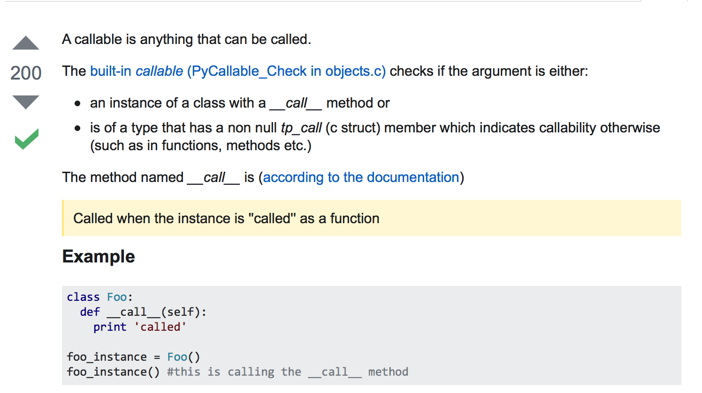
- 如何理解python everything is object
  - class，function，attribute，数据类型都是对象
- python的pass关键字
  - Python pass是空语句,是为了保持程序结构的完整性。 pass 不做任何事情,一般用做占位语句
  - 为什么要有空语句
- 什么是lamda表达式
- 如何理解python paste deploy
  - paste deploy是用来配置和管理WSGI 应用的一套系统，对于WSGI应用的使用者而言，可以方便地从配置文件汇总加载WSGI应用（loadapp）；对于WSGI应用的开发人员而言，只需要给自己的应用提供一套简单的入口点即可

##### 2017.06.09  
- 叶子节点
  - 叶子结点是离散数学当中的概念。一棵树当中没有子结点（即度为0）的结点，称为叶子结点，简称“叶子”。叶子是指度为0的结点，又称为终端结点。
- IOPS
  - IOPS (Input/Output Per Second)即每秒的输入输出量(或读写次数)，是衡量磁盘性能的主要指标之一。IOPS是指单位时间内系统能处理的I/O请求数量，一般以每秒处理的I/O请求数量为单位，I/O请求通常为读或写数据操作请求
  - IOPS和数据吞吐量适用于不同的场合：
    - 读取10000个1KB文件，用时10秒  Throught(吞吐量)=1MB/s ，IOPS=1000  追求IOPS
    - 读取1个10MB文件，用时0.2秒  Throught(吞吐量)=50MB/s, IOPS=5  追求吞吐量
- 关于ceph数据寻址
  - Linux 透视图中的一个文件会分配到一个来自元数据服务器的 inode number（INO），对于文件这是一个唯一的标识符。然后文件被推入一些对象中（根据文件的大小）。使用 INO 和 object number（ONO），每个对象都分配到一个对象 ID（OID）。在 OID 上使用一个简单的哈希，每个对象都被分配到一个放置组。
  - 

- Ceph的Cache分层是什么？
  - Cache Tiering的基本思想就是冷热数据分离，用相对快速／昂贵的存储设备比如SSD，组成一个Pool来作为Cache层，后端用相对慢速／廉价的设备来组建冷数据存储池，作为Storage层或者是Base层。Cache层维护有Base层的一部分数据，Cache层需要是多副本模式，Storage层可以是多副本模式或者纠删码模式。
- 什么是ARP
  - 地址解析协议，即ARP（Address Resolution Protocol），是根据IP地址获取物理地址的一个TCP/IP协议。主机发送信息时将包含目标IP地址的ARP请求广播到网络上的所有主机，并接收返回消息，以此确定目标的物理地址；收到返回消息后将该IP地址和物理地址存入本机ARP缓存中并保留一定时间，下次请求时直接查询ARP缓存以节约资源
- NAT
  - NAT（Network Address Translation）是指在数据包传递过程中，修改IP报头中的源或者目的地址的过程。
  - SNAT
    - 源网络地址转换
    - 应用多个PC使用路由器共享上网
  - DNAT
    - 目的网络地址转换
    - Web服务器放在内网以配置内网IP，前端有个防火墙配置公网IP，互联网上的访问者使用公网IP来访问这个网站，当访问的时候客户端发送一个数据包，这个数据包的报头里面目标地址是防火墙的公网IP，防火墙就会吧这个数据包的报头修改一次，用目标地址改写Web服务器的内网IP，然后再把这个数据包发送到内网的Web服务器上。
- 如何理解网路二层设别和三层设备
- IP报文
  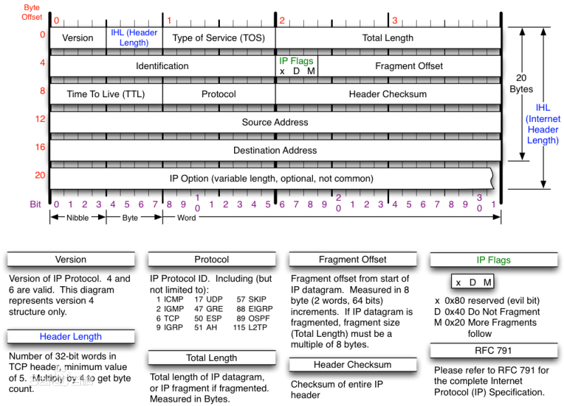
- 关于linux防火墙
  - 其实iptables只是Linux防火墙的管理工具而已，位于/sbin/iptables。真正实现防火墙功能的是 netfilter，它是Linux内核中实现包过滤的内部结构。
  - iptables传输数据包的过程
    1. 当一个数据包进入网卡时，它首先进入PREROUTING链，内核根据数据包目的IP判断是否需要转送出去。
    2. 如果数据包就是进入本机的，它就会沿着图向下移动，到达INPUT链。数据包到了INPUT链后，任何进程都会收到它。本机上运行的程序可以发送数据包，这些数据包会经过OUTPUT链，然后到达POSTROUTING链输出。
    3. 如果数据包是要转发出去的，且内核允许转发，数据包就会如图所示向右移动，经过FORWARD链，然后到达POSTROUTING链输出。
    
- 什么是VLAN
- OpenStack的API路由是如何实现的？
##### 2017.06.11
- 什么是git pull和git fetch？
  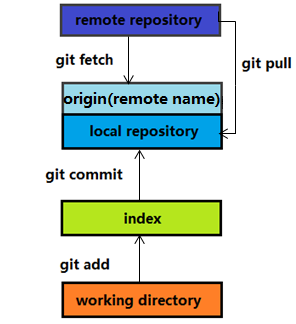

- jude图中的opt和alt什么意思？
  - alt 多选一的片段，只有条件为真者会执行
  - opt 可选的，该片段只在所给条件为真时执行，等同于只有一个片断的alt
  - **UML详细见 http://blog.sina.com.cn/s/blog_72ef7bea0100p2hz.html**
- 聚合关系
  - 关联关系的一种，是一种强关联关系；聚合关系是整体和个体/部分之间的关系；关联关系的两个类处于同一个层次上，而聚合关系的两个类处于不同的层次上，一个是整体，一个是个体/部分；在聚合关系中，代表个体/部分的对象有可能会被多个代表整体的对象所共享
- 组合关系
  - 也是关联关系的一种，但它是比聚合关系更强的关系。组合关系要求聚合关系中代表整体的对象要负责代表个体/部分的对象的整个生命周期；组合关系不能共享；在组合关系中，如果代表整体的对象被销毁或破坏，那么代表个体/部分的对象也一定会被销毁或破坏；而聚在合关系中，代表个体/部分的对象则有可能被多个代表整体的对象所共享，而不一定会随着某个代表整体的对象被销毁或破坏而被销毁或破坏。

#### 2017.06.11
- 什么是python 的tox
  - Tox is a generic virtualenv management and test command line tool you can use for
    - checking your package installs correctly with different Python versions and interpreters
    - running your tests in each of the environments, configuring your test tool of choice
    - acting as a frontend to Continuous Integration servers, greatly reducing boilerplate and merging CI and shell-based testing.
    - Tox Sample
      - http://www.sohu.com/a/120074606_487512
- python如何调用shell命令
  - os.system
    - os.system('cat /proc/cpuinfo')
    - 没有输出结果
  - os.popen()
      ```
      output = os.popen('cat /proc/cpuinfo')
      print output.read()
      ```
    - 有输出结果，但是没有返回结果
  - commands.getstatusoutput()
      ```
      (status, output) = commands.getstatusoutput('cat /proc/cpuinfo')
      print status, output
      ```
      - 可以获得到返回值和输出，非常好用
- linux创建进程的方法
- linux创建线程的方法
- python创建进程的方法
- python创建线程的方法
- 什么是mapreduce
- 什么是

- 如何升级pip和setuptools
  - python -m pip install -U pip setuptools
  - vi /opt/stack/devstack/inc/python

#### 2017.06.15
- keystone服务启动失败临时对应方法
  ```
  #!/usr/bin/env bash
  sudo mkdir /var/run/uwsgi/
  sudo chown stack /var/run/uwsgi/
  sudo systemctl start devstack@keystone.service
  sudo systemctl start devstack@placement-api.service
  ```
- devstack环境下，openstack各模块服务所在位置
  /etc/systemd/system
- systemctl状态查看命令
  - systemctl status devstack@keystone.service
- journalctl查看日志
  - journalctl -f --unit devstack@keystone.service
  - sudo journalctl -f --unit devstack@c-vol.service

- c-vol中ERROR cinder.service [-] Manager for service cinder-volume localhost.localdomain@lvmdriver-1 is reporting problems, not sending heartbeat. Service will appear "down".的问题
  ```
  sudo losetup -f /opt/stack/data/stack-volumes-default-backing-file
  sudo losetup -f /opt/stack/data/stack-volumes-lvmdriver-1-backing-file
  ```
#### 2017.06.15  
- 如何理解losetup
  - 用来设置循环设备的命令，让用户可以像访问块设备一样访问一个文件夹。
  - 循环设备：
    - loop device：unix系统下的伪设备，需要同一个文件进行连接。
      利用losetup命令，loop设备可以将文件虚拟成块设备。
- 什么是libvirt
- 什么是QEMU
- 什么是Xen
- WSGI是什么？
  - Web Server Gateway Interface Web服务器通用网关接口，是Python语言所定义的Web服务器和Web应用程序或框架之间的接口标准。
  - 从名称来看，WSGI是一个网关，作用就是协议之间进行转换，WSGI就是一座桥梁（服务器／网关端<-->WSGI<-->应用端／框架端）
  - WSGI将Web组件分为三类，Web服务器（WSGI Server） <--> Web中间件（WSGI Middleware）<--> Web应用程序（WSGI Application）
  - WSGI Server
    - WSGI Server接收HTTP请求，封装一系列环境变量（environ），按照WSGI接口标准调用注册的WSGI Application，最后将响应返回给客户端。
  - WSGI Application
    - WSGI Application是一个可被调用的Python对象，它接收2个参数，通常为environ和start_response。
    - 当处理一个WSGI请求时，服务端为应用端提供上下文信息（environ）和一个回调函数（start_response），当应用处理完请求后，使用服务端提供的回调函数返回相对应的处理结果。
    ```
    def application(environ, start_response):
    start_response('200 OK', [('Content-Type', 'text/html')])
    return '<h1>Hello, web!</h1>'
    ```
- 如何打印openstack router信息
#### 2017.06.19
- HTTP协议状态码
  - 1××　　保留  
  - 2××　　表示请求成功地接收
    - 200 OK
    - 202 Accepted
  - 3××　　为完成请求客户需进一步细化请求  
  - 4××　　客户错误  
    - 400 Bad Request
    - 401 Unauthorized
    - 403 Forbidden
    - 404 Not Found (服务器找不到任何匹配Request-URI的资源)
  - 5××　　服务器错误  
#### 2017.06.20
- 关于反斜杠
在Windows系统中，正斜杠/表示除法，用来进行整除运算；反斜杠\用来表示目录。在Unix系统中，/表示目录；\表示跳脱字符将特殊字符变成一般字符（如enter,$,空格等）。

- ceph需要哪些内核的支持
  - rbd.ko
  - xfs.ko
  - libceph.ko
  - ceph.ko
  - btrfs.ko
- 如何理解Bootloader
- kernel modules自动加载
  
- /sys/module/MODULENAME
  - /sys/module下包含了手动加载到内核的模块和一部分内置模块（模块有版本或者有至少一个参数）

#### 2017.06.23
- Android 驱动开发需要哪些知识
  - linux内核
    - Linux Kernel Development
    - Understanding the Linux Kernel
  - linux驱动程序
    - Linux Device Drivers
  - linux C编程，API
  - Android HAL
- 如何理解uboot
  - Universal Boot Loader，是一个开源的主要的boot loader 应用于嵌入式设备，封装了指令用于启动操作系统内核。
  - uboot是众多boot loader其中一种
- 如何理解Bootloader
  - Bootloader是嵌入式设备开机后执行的第一段小程序，位于ROM里面，用于装载内核和操作系统到内存中执行。
- 如何编写linux kernel modules
  - 进入函数xxxx_init
  - 退出函数xxxx_exit
  - module_param用于传递命令行参数 , module_param(varname, type, defaultval)
- linux
- 如何查看内核符号表
  - cat /proc/kallsym
  - 这里面有printk，因此我们编写内核模块时可以直接使用
- 内核块模与device driver的关系
  - device driver时内核模块的一种
  - unix系统中，/dev/下的一个文件，代表一个硬件设备。文件提供方法与具体的硬件交互。
- 32bit架构的RAM地址空间
  - 所有空间
    - 0x00000000 - 0xffffffff （4G）
  - 内核空间
    - 0xc0000000 - 0xffffffff （1G）
    - 内核程序运行在这里，具有所有内存和硬件设备的访问权限
  - 用户空间
    - 0x00000000 - 0xbfffffff （3G）
    - 用户程序运行在这里，用户程序无法直接访问内核空间，用户程序通过系统调用访问一部分内核
- 关于ioctl
  - ioctl是一个系统调用
  - ioctl由应用程序发起（用户空间），驱动程序负责实现相应的命令请求（内核空间）
- tty是什么
  - tty是Teletype的缩写
  - 终端是一种字符型设备，有很多种类型，通常用tty代表各种类型的终端设备。
- 如何理解中断
  - 中断的概念
    - CPU执行程序过程中，由外部硬件设备发出中断信号，CPU保存当前中断上下文内容，转而去执行中断处理程序，执行完中断处理程序返回到中断前执行程序的位置继续执行接下来的程序的过程叫中断。
    - 相比与让CPU轮询设备状态，中断机制，能更充分利用CPU，中断的目的就是让CPU不必等待外围的慢设备
  - 硬件中断
    - 异步信号
    - 来源于外设
  - 软件中断
    - 来源于当前CPU正在执行的程序
  - 中断向量
    - 中断程序入口地址
- Android HAL
- 如何理解GPL
  - 全称为GNU General Public License
  - 要求GPL程序的派生作品也要在GPL之下
  - 著名的软件 emacs，linux核心，gcc
  - **只要在一个软件中使用("使用"指类库引用，修改后的代码或者衍生代码)GPL 协议的产品，则该软件产品必须也采用GPL协议，既必须也是开源和免费。**
  - 规避GPL感染的方法，地址空间隔离，RPC通信
- LGPL
  - **LGPL允许商业软件通过类库引用(link)方式使用LGPL类库而不需要开源商业软件的代码。**

- 如何理解JNI
  - Java Native Interface 是一种编程框架，使得Java虚拟机中的Java程序可以调用本地应用／库，也可以被其他程序调用。本地程序一般是由其他语言（C、C++、汇编等）编写的，并且被编译为基于本机硬件和操作系统的程序。
  - JNI函数命名规则
    - Java_包名_类名_方法名

#### 2017.06.26
- linux和unix的联系与区别
  - 联系：
    - unix历史久于linux，linux思想源于unix
  - 区别：
    - unix大多与硬件配套，linux可运行在多种硬件平台上
    - unix是商业软件，linux是开源软件
- linux整体架构图
  
- linux内核构成
  - Process Scheduler
  - Memory Management
  - Virtual Filesystem
  - Network
  - IPC
- linux操作系统包含什么东西
- Android
  - Android是基于linux内核的开放源代码移动操作系统。
  - 许可证
    - Apache许可证2.0和GPL v2
    - GPL v2和GPL的区别
      - 加入“liberty or death”条款，即如果哪个人在发布GPL软件时添加附加强制的条款，那么他根本无权发布软件。
  - 支持平台
    - ARM、MIPS、Power Architecture、x86、x86-64
  - HAL
    - Android的硬件抽象层能以封闭源码的形式提供硬件驱动模块。
    - HAL以.so存在，可以把Android Framework同Linux kernel隔离开，
- 什么是范式
- 关于tar命令
  - -x Extract
  - -c Compress
  - -j bizp2
  - -z gzip
  - -v verbose output
  - -f file name
  - -p preserve file permission
- 什么是CRC校验
- 什么是奇偶校验
- linux启动
  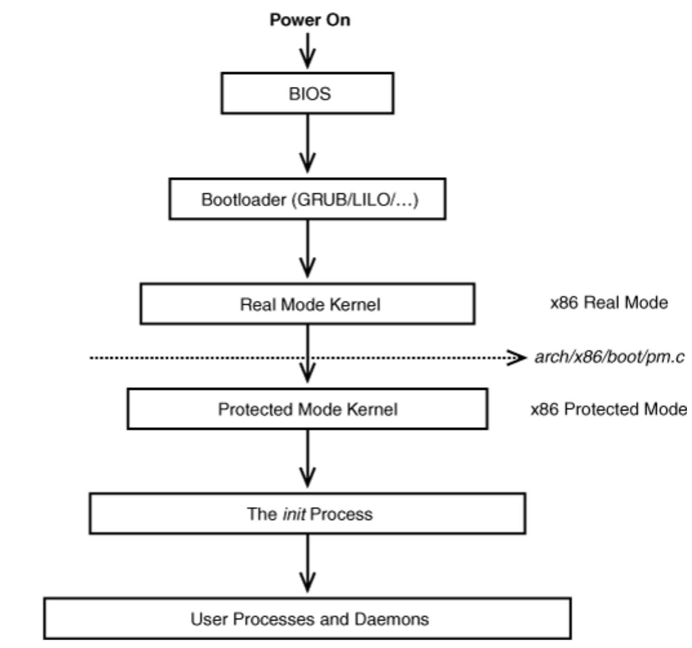
- x86实模式和保护模式
  - 实模式只能访问0x00000000～0x000fffff
- 关于bios中断向量表
  - INT3 暂停
  - INT10 向屏幕打印一个字符
    - ```
    mov ah, 0x0e
    mov al, '!'
    int 0x10
    ```
  - INT15 获取memory map，physical memory ranges
    - INT 15h, AX=E801h - Get Memory Size for Large Configurations
    - INT 15h, AH=88h - Get Extended Memory Size
    - 在linux启动过程中，kernel实模式初始化代码调用BIOS INT15，AX=0xe820取得当前系统的memory map
  - INT21 返回
- low memory
  - 0M ～ 896M
  - kmalloc() 在这里申请内存
- high memory
  - 896M～1024M
  - 只有通过特殊的内存映射才能访问
- Endian
  - Big-Endian
    - ```0x12345678
  0x00000000 0x12
  0x00000001 0x34
  0x00000002 0x56
  0x00000003 0x78```
  - Little-Endian
    - ```0x12345678
  0x00000000 0x78
  0x00000001 0x56
  0x00000002 0x34
  0x00000003 0x12```
  - Endian test
    - ```
    static union { char c[4]; unsigned long mylong; }
    endian_test = {{ 'l', '?', '?', 'b' } };
    #define ENDIANNESS ((char)endian_test.mylong)  
    ```
- 什么是initramfs
  - linux内核加载文件系统执行/sbin/init程序前，需要找到根设备的位置，如果根设备需要驱动支持，内核可能无能无力，通过提供一个临时的过渡临时文件系统，将加载真正文件系统需要的设备驱动、工具以及初始化程序加载到内存运行。
- 进程上下文
  - 抢占式
- 中断上下文
  - 非抢占式
  - 不允许做的事情
    - 睡眠或让出CPU
    - 取得Mutex
    - 执行耗时任务
    - 访问用户空间虚拟内存
- 抢占式内核的硬件基础
- 什么是SMP
  - Symmetrical Multi-Processing技术，是指在一个计算机上汇集了一组处理器(多CPU),各CPU之间共享内存子系统以及总线结构.
  - SMP safe：允许多个CPU操作同一块代码块，如果代码块的数据已经被一个CPU更新，其他的CPU会认为这块代码无效，需要更新后再继续操作。
- 什么时临界区
  - 访问共享资源的代码叫做临界区。
- 内核同步方法
    - spinlocks
      - 访问繁忙临界区时，thread不休眠
      - 中断处理函数中必须使用spinlocks
    - mutexes
      - 访问繁忙临界区时，thread休眠
      - 如果临界区需要执行休眠处理，必须使用mutexes
- 抢占式内核与非抢占式内核
  - 抢占式内核实现的基础
    - 时钟？
    - 进程的优先级
      - 基于优先级的调度法指，CPU总是让处在就绪态的优先级最高的任务先运行
  - 抢占式内核的定义
    - 如果进程正在执行内核函数，即他在内核态运行时，允许发生内核切换（被切换的进程时正在执行内核函数的进程），这个内核就时抢占式的，linux2.6引入。
    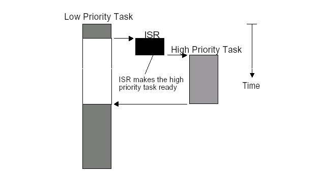
  - 非抢占式内核的定义
    
  - 抢占式内核的意义
    - 为了将linux应用于实时系统所必须的。实时系统对响应时间有严格规定，当一个实时进程被实时设备的硬件中断唤醒后，它应该在限定的时间内被执行。
  - 什么情况下不允许内核抢占
    - 内核正在进行中断处理。linux内核中进程不能抢占中断（中断只能被其他中断终止、抢占，进程不能终止、抢占中断）
    - 内核正在进行中断的上下文的Bottom Half处理
    - 内核代码段正持有spinlock自旋锁，writelock／readlock读写锁等锁，处于这些锁的保护中。内核中的这些锁，是为了在SMP系统中短时间内保证不同CPU运行的进程并发执行的正确性。
    - 内核正在执行调度程序Scheduler。
    - 内核正在对每个CPU的私有数据结构进行操作。
  - 内核抢占时机
    - 中断处理程序执行，返回内核前。
    - 在内核代码再次具有可抢占性的时候。
    - 内核任务显示调用schedule（）
    - 内核中任务阻塞
  - 如何支持内核抢占
    - preempt_count抢占锁，在中断入口／锁操作前进行preempt_count++，中断出口／锁操作后进行preempt_count--。
- 实时系统
  - 又称即时操作系统，相对于一般的操作系统，最大的特点就是“实时性”，如果有一个任务需要执行，实时操作系统就会马上执行，不会有较长时间的延迟。
  - 两种驱动类型
    - 时间驱动
    - 事件驱动
  - linux是作为通用操作系统开发，linux内核实时处理能力上先天不足，经过部分开发社区改造，一定程度上成为实时操作系统。
- 32bit系统内存
  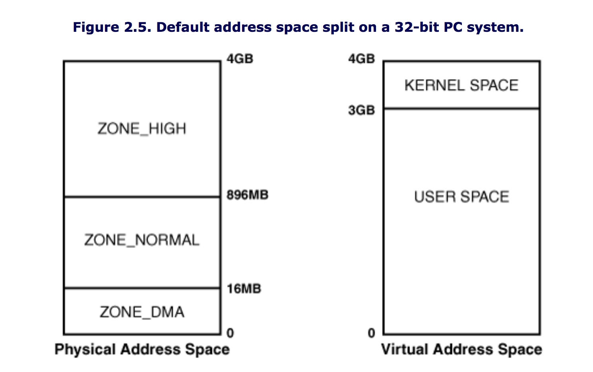  
  - ZONE_DMA
    - ISA Device
  - ZONE_NORMAL
    - kmalloc 在此处申请内存
    - vmalloc 用于申请更大的内存
  - ZONE_HIGH
    -
- ISA
  - ISA总线
    - (Industry Standard Architecture:工业标准体系结构）是为PC/AT电脑而制定的总线标准，为16位体系结构，只能支持16位的I/O设备，数据传输率大约是16MB/S。也称为AT标准

#### 2017.06.28
- 网卡的接口
  - RJ-45
- MII
  -  MII即媒体独立接口,它是IEEE-802.3定义的以太网行业标准."媒体独立"表明在不对MAC硬件重新设计或替换的情况下,任何类型的PHY设备都可以正常工作.它包括一个数据接口,以及一个MAC和PHY之间的管理接口.
  - 在IEEE802.3中规定的MII总线是一种用于将不同类型的PHY与相同网络控制器(MAC)相连接的通用总线.网络控制器可以用同样的硬件接口与任何PHY .
- GMII
  - Gigabyte MII
- RGMII
  - Reduce Gigabyte MII
- SGMII
  - Serial Gigabyte MII
- 网卡PHY和MAC的区别
  - 网卡工作在OSI模型的最后两层，MAC工作在数据链路层，PHY工作在物理层
  - pci总线->mac->phy-网线
- EEPROM
  - Electrically Erasable Programmable Read-Only Memory，电可擦除只读存储器，掉电后不丢失数据，可以作为BIOS存储芯片。
- 什么是网卡驱动
  - 提供接口给内核，进而让内核可以对硬件进行操作。
- 网卡驱动程序与其他驱动程序的不同点
  - 网卡驱动程序，不依赖与/sys和/dev与用户空间通信，应用程序是通过网络接口（eth0）与NIC驱动程序进行通信。网络接口对底层协议进行了抽象。
- 驱动程序的数据结构
  - 形成网络协议构造块的数据结构 sk_buff
  - 协议和驱动程序间接口的数据结构 net_device
  - 与总线相关的数据结构
- linux网络子系统
  

- 设备无关层到驱动层
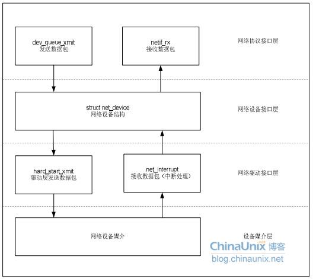  
  - 网络协议接口层，对网络协议层提供统一的数据收发接口。
    - 数据发送接口 dev_queue_xmit
    - 数据接收接口 netif_rx
  - 网络设备接口层，对网络协议接口层，提供网络设备结构net_device，该结构体是网络驱动接口层各函数的容器。
    - 主要设备方法
      - register_netdev
      - unregister_netdev
      - open
      - stop
      - hard_start_xmit
      - tx_timeout
  - 网络驱动接口层，实现net_device结构。是驱使网络硬件完成响应动作的程序。
    - hard_start_xmit
    - net_interrupt
  - 设备媒介层，数据包发送和接收的实体。
- 开发网卡驱动过程中，对设备树的设定
- 用什么调试项目
- 如何测试驱动
- 网卡中ring的概念
- e1000_copybreak
- e1000_clean_rx_irq
- napi_schedule
- 网络字节序
  - 4字节32bit值以0～7bit、8～15bit、16～23bit、24～31bit传输，这种传输次序为big-endian。
- sk_buff
  - sk_buff结构
      
    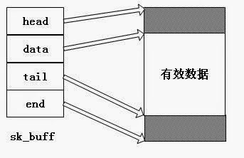  
  - sk_buff成员
    - head：内存中已申请的，用户网络数据缓冲区的起始地址，不可变。
    - data：指向当前协议有效的数据的起始地址。
      - data指针随当前协议层变化而进行移动
      - 传输层：-> TCPHeader+用户数据  L4
      - 网络层：-> IPHeader+TCPHeader+用户数据 L3
      - 链路层：-> EthernetHeader+IPHeader+TCPHeader+用户数据 L2
    - tail：向当前协议有效的数据的终止地址。
    - end：存中已申请的，用户网络数据缓冲区的终止地址。
    - len：线性数据区+非线性数据区（fragment片段）
    - data_len：非线性数据区（fragment）
  - sk_buff相关操作
    - skb_put
      ```tmp = tail
      tail += n
      len += n
      return tmp
      ```
      在尾部追加n字节数据。
    - skb_push
      ```data -= n
      len += n
      return data
      ```
      指向更靠近链路层的数据头。
    - skb_pull
      ```data += n
      len -= n
      return data
      ```
      指向更靠近传输层的数据头。
      通常用于从底层向上传输数据时一层层的分解数据。
    - skb_reserve
      ```data += n
      tail += n
      return data
      ```
- L4(传输层)到L2(链路层)的过程
  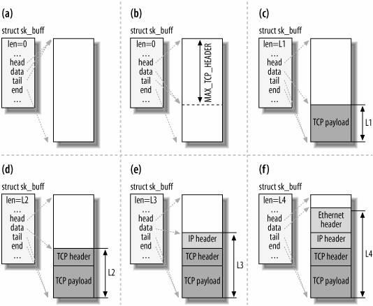
  - 申请sk_buff
  - 添加TCP payload
  - 添加TCP Header
  - 添加IP Header
  - 添加Ethernet Header
- L2(链路层)到L2(传输层)的过程（skb_pull）
  - 解析Ethernet Header
  - 解析IP Header
  - 解析TCP Header

- sk_buff既存在双向链表同时存在非线性存储区
  - 只有在DMA支持物理分散页的Scatter/Gather（SG，分散/聚集）操作时候才可以使用frags[]来保存剩下的数据，否则，只能扩展线性数据区域进行保存！
- SPI
  - Serial Peripheral Interface， 串行外设接口，高速的全双工同步的通信总线。
  - SPI构成
    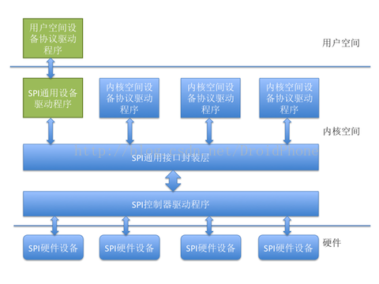
    - SPI控制器
    - SPI从设备（Flash、网卡等）
      - SPI从设备驱动
        - linux设备树中添加spi设备
        - 注册设备驱动到spi驱动管理器中，让spi驱动管理器统一管理。

#### 2017.07.03
- NAPI
  - New API是综合中断和轮询方式的网卡API。网络数据量较小时，采用中断方式，网络数据很大时采取轮询方式。
  - NAPI和传统API的区别
    - 支持NAPI的网卡驱动必须提供轮询方法poll()
    - 传统API内核接口为netif_rx, NAPI接口为napi_schedule()
    - 传统API使用共享的CPU队列softnet_data->input_pkt_queue，NAPI使用设备内存（或者设备驱动程序的接收环）
    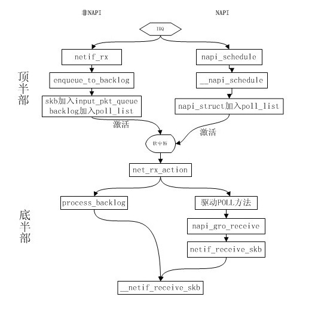
#### 2017.07.06
- Android架构
- JNI格式
- JPEG格式
- 各种压缩格式的区别
  - .tar:tar本质是归档工具，而非压缩工具
  - .tar.gz:tar工具打包，gzip工具压缩
  - .tar.bz2:tar工具打包，bzip2工具压缩
  - .zip:zip工具压缩
    - 跨平台
    - 压缩比不高
  - .xz 压缩率之王？
    - 压缩比高，压缩时间稍长
    - tar不支持xz参数 需要
      - 压缩过程
        - tar cvf xxx.tar xxx/
        - xz -z xxx.tar ->xxx.tar.xz
      - 解压过程
        - xz -d xxx.tar.xz -> xxx.tar
        - tar xvf xxx.tar
