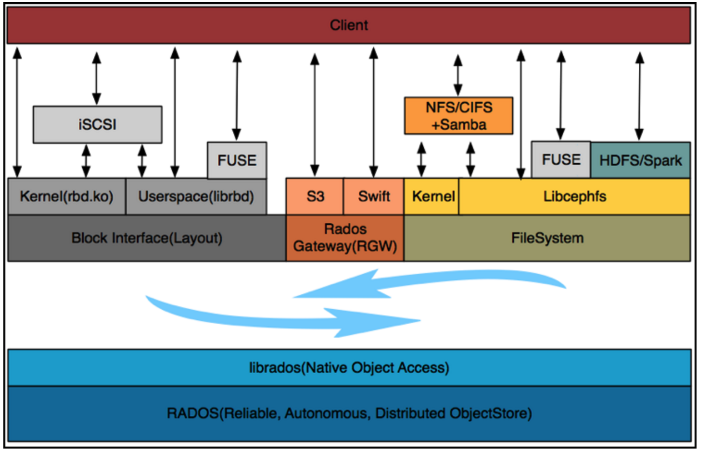

- ceph架构
    
    - 自己的理解
        - rbd
            - 块存储，提供卷服务
            - 用户态
                - librbd.so通过QEMU Driver给KVM虚拟机使用
            - 内核态
                - rbd.ko内核模块和librbd.so，给物理主机使用
        - cephfs
            - 提供文件系统服务（NFS/CIFS）
            - libcephfs.so
            - posix接口
        - rgw
            - 提供对象存储接口
            - Amazon S3
            - OpenStack Swift

- 
    ```
    static void rbd_watch_errcb(void *arg, u64 cookie, int err)
{
	struct rbd_device *rbd_dev = arg;

	rbd_warn(rbd_dev, "encountered watch error: %d", err);

	down_write(&rbd_dev->lock_rwsem);
	rbd_set_owner_cid(rbd_dev, &rbd_empty_cid);
	up_write(&rbd_dev->lock_rwsem);

	mutex_lock(&rbd_dev->watch_mutex);
	if (rbd_dev->watch_state == RBD_WATCH_STATE_REGISTERED) {
		__rbd_unregister_watch(rbd_dev);
		rbd_dev->watch_state = RBD_WATCH_STATE_ERROR;

		queue_delayed_work(rbd_dev->task_wq, &rbd_dev->watch_dwork, 0);
	}
	mutex_unlock(&rbd_dev->watch_mutex);
}


    static int __rbd_register_watch(struct rbd_device *rbd_dev)
{
	struct ceph_osd_client *osdc = &rbd_dev->rbd_client->client->osdc;
	struct ceph_osd_linger_request *handle;

	rbd_assert(!rbd_dev->watch_handle);
	dout("%s rbd_dev %p\n", __func__, rbd_dev);

	handle = ceph_osdc_watch(osdc, &rbd_dev->header_oid,
				 &rbd_dev->header_oloc, rbd_watch_cb,
				 rbd_watch_errcb, rbd_dev);
	if (IS_ERR(handle))
		return PTR_ERR(handle);

	rbd_dev->watch_handle = handle;
	return 0;
}

struct ceph_osd_linger_request *
ceph_osdc_watch(struct ceph_osd_client *osdc,
		struct ceph_object_id *oid,
		struct ceph_object_locator *oloc,
		rados_watchcb2_t wcb,
		rados_watcherrcb_t errcb,
		void *data)
{
	struct ceph_osd_linger_request *lreq;
	int ret;

	lreq = linger_alloc(osdc);
	if (!lreq)
		return ERR_PTR(-ENOMEM);

	lreq->is_watch = true;
	lreq->wcb = wcb;
	lreq->errcb = errcb;
	lreq->data = data;
	lreq->watch_valid_thru = jiffies;

	ceph_oid_copy(&lreq->t.base_oid, oid);
	ceph_oloc_copy(&lreq->t.base_oloc, oloc);
	lreq->t.flags = CEPH_OSD_FLAG_WRITE;
	ktime_get_real_ts(&lreq->mtime);

	lreq->reg_req = alloc_linger_request(lreq);
	if (!lreq->reg_req) {
		ret = -ENOMEM;
		goto err_put_lreq;
	}

	lreq->ping_req = alloc_linger_request(lreq);
	if (!lreq->ping_req) {
		ret = -ENOMEM;
		goto err_put_lreq;
	}

	down_write(&osdc->lock);
	linger_register(lreq); /* before osd_req_op_* */
	osd_req_op_watch_init(lreq->reg_req, 0, lreq->linger_id,
			      CEPH_OSD_WATCH_OP_WATCH);
	osd_req_op_watch_init(lreq->ping_req, 0, lreq->linger_id,
			      CEPH_OSD_WATCH_OP_PING);
	linger_submit(lreq);
	up_write(&osdc->lock);

	ret = linger_reg_commit_wait(lreq);
	if (ret) {
		linger_cancel(lreq);
		goto err_put_lreq;
	}

	return lreq;

err_put_lreq:
	linger_put(lreq);
	return ERR_PTR(ret);
}
EXPORT_SYMBOL(ceph_osdc_watch);

static int rbd_register_watch(struct rbd_device *rbd_dev)
{
	int ret;

	mutex_lock(&rbd_dev->watch_mutex);
	rbd_assert(rbd_dev->watch_state == RBD_WATCH_STATE_UNREGISTERED);
	ret = __rbd_register_watch(rbd_dev);
	if (ret)
		goto out;

	rbd_dev->watch_state = RBD_WATCH_STATE_REGISTERED;
	rbd_dev->watch_cookie = rbd_dev->watch_handle->linger_id;

out:
	mutex_unlock(&rbd_dev->watch_mutex);
	return ret;
}

static struct rbd_device *__rbd_dev_create(struct rbd_client *rbdc,
					   struct rbd_spec *spec)
{
	struct rbd_device *rbd_dev;

	rbd_dev = kzalloc(sizeof(*rbd_dev), GFP_KERNEL);
	if (!rbd_dev)
		return NULL;

	spin_lock_init(&rbd_dev->lock);
	INIT_LIST_HEAD(&rbd_dev->node);
	init_rwsem(&rbd_dev->header_rwsem);

	rbd_dev->header.data_pool_id = CEPH_NOPOOL;
	ceph_oid_init(&rbd_dev->header_oid);
	rbd_dev->header_oloc.pool = spec->pool_id;

	mutex_init(&rbd_dev->watch_mutex);
	rbd_dev->watch_state = RBD_WATCH_STATE_UNREGISTERED;
	INIT_DELAYED_WORK(&rbd_dev->watch_dwork, rbd_reregister_watch);

	init_rwsem(&rbd_dev->lock_rwsem);
	rbd_dev->lock_state = RBD_LOCK_STATE_UNLOCKED;
	INIT_WORK(&rbd_dev->acquired_lock_work, rbd_notify_acquired_lock);
	INIT_WORK(&rbd_dev->released_lock_work, rbd_notify_released_lock);
	INIT_DELAYED_WORK(&rbd_dev->lock_dwork, rbd_acquire_lock);
	INIT_WORK(&rbd_dev->unlock_work, rbd_release_lock_work);
	init_waitqueue_head(&rbd_dev->lock_waitq);

	rbd_dev->dev.bus = &rbd_bus_type;
	rbd_dev->dev.type = &rbd_device_type;
	rbd_dev->dev.parent = &rbd_root_dev;
	device_initialize(&rbd_dev->dev);

	rbd_dev->rbd_client = rbdc;
	rbd_dev->spec = spec;

	return rbd_dev;
}

static struct rbd_device *rbd_dev_create(struct rbd_client *rbdc,
					 struct rbd_spec *spec,
					 struct rbd_options *opts)
{
	struct rbd_device *rbd_dev;

	rbd_dev = __rbd_dev_create(rbdc, spec);
	if (!rbd_dev)
		return NULL;

	rbd_dev->opts = opts;

	/* get an id and fill in device name */
	rbd_dev->dev_id = ida_simple_get(&rbd_dev_id_ida, 0,
					 minor_to_rbd_dev_id(1 << MINORBITS),
					 GFP_KERNEL);
	if (rbd_dev->dev_id < 0)
		goto fail_rbd_dev;

	sprintf(rbd_dev->name, RBD_DRV_NAME "%d", rbd_dev->dev_id);
	rbd_dev->task_wq = alloc_ordered_workqueue("%s-tasks", WQ_MEM_RECLAIM,
						   rbd_dev->name);
	if (!rbd_dev->task_wq)
		goto fail_dev_id;

	/* we have a ref from do_rbd_add() */
	__module_get(THIS_MODULE);

	dout("%s rbd_dev %p dev_id %d\n", __func__, rbd_dev, rbd_dev->dev_id);
	return rbd_dev;

fail_dev_id:
	ida_simple_remove(&rbd_dev_id_ida, rbd_dev->dev_id);
fail_rbd_dev:
	rbd_dev_free(rbd_dev);
	return NULL;
}

static ssize_t do_rbd_add(struct bus_type *bus,
			  const char *buf,
			  size_t count)
{
	struct rbd_device *rbd_dev = NULL;
	struct ceph_options *ceph_opts = NULL;
	struct rbd_options *rbd_opts = NULL;
	struct rbd_spec *spec = NULL;
	struct rbd_client *rbdc;
	bool read_only;
	int rc;

	if (!try_module_get(THIS_MODULE))
		return -ENODEV;

	/* parse add command */
	rc = rbd_add_parse_args(buf, &ceph_opts, &rbd_opts, &spec);
	if (rc < 0)
		goto out;

	rbdc = rbd_get_client(ceph_opts);
	if (IS_ERR(rbdc)) {
		rc = PTR_ERR(rbdc);
		goto err_out_args;
	}

	/* pick the pool */
	rc = rbd_add_get_pool_id(rbdc, spec->pool_name);
	if (rc < 0) {
		if (rc == -ENOENT)
			pr_info("pool %s does not exist\n", spec->pool_name);
		goto err_out_client;
	}
	spec->pool_id = (u64)rc;

	rbd_dev = rbd_dev_create(rbdc, spec, rbd_opts);
	if (!rbd_dev) {
		rc = -ENOMEM;
		goto err_out_client;
	}
	rbdc = NULL;		/* rbd_dev now owns this */
	spec = NULL;		/* rbd_dev now owns this */
	rbd_opts = NULL;	/* rbd_dev now owns this */

	rbd_dev->config_info = kstrdup(buf, GFP_KERNEL);
	if (!rbd_dev->config_info) {
		rc = -ENOMEM;
		goto err_out_rbd_dev;
	}

	down_write(&rbd_dev->header_rwsem);
	rc = rbd_dev_image_probe(rbd_dev, 0);
	if (rc < 0) {
		up_write(&rbd_dev->header_rwsem);
		goto err_out_rbd_dev;
	}

	/* If we are mapping a snapshot it must be marked read-only */

	read_only = rbd_dev->opts->read_only;
	if (rbd_dev->spec->snap_id != CEPH_NOSNAP)
		read_only = true;
	rbd_dev->mapping.read_only = read_only;

	rc = rbd_dev_device_setup(rbd_dev);
	if (rc)
		goto err_out_image_probe;

	if (rbd_dev->opts->exclusive) {
		rc = rbd_add_acquire_lock(rbd_dev);
		if (rc)
			goto err_out_device_setup;
	}

	/* Everything's ready.  Announce the disk to the world. */

	rc = device_add(&rbd_dev->dev);
	if (rc)
		goto err_out_image_lock;

	add_disk(rbd_dev->disk);
	/* see rbd_init_disk() */
	blk_put_queue(rbd_dev->disk->queue);

	spin_lock(&rbd_dev_list_lock);
	list_add_tail(&rbd_dev->node, &rbd_dev_list);
	spin_unlock(&rbd_dev_list_lock);

	pr_info("%s: capacity %llu features 0x%llx\n", rbd_dev->disk->disk_name,
		(unsigned long long)get_capacity(rbd_dev->disk) << SECTOR_SHIFT,
		rbd_dev->header.features);
	rc = count;
out:
	module_put(THIS_MODULE);
	return rc;

err_out_image_lock:
	rbd_dev_image_unlock(rbd_dev);
err_out_device_setup:
	rbd_dev_device_release(rbd_dev);
err_out_image_probe:
	rbd_dev_image_release(rbd_dev);
err_out_rbd_dev:
	rbd_dev_destroy(rbd_dev);
err_out_client:
	rbd_put_client(rbdc);
err_out_args:
	rbd_spec_put(spec);
	kfree(rbd_opts);
	goto out;
}

static ssize_t rbd_add(struct bus_type *bus,
		       const char *buf,
		       size_t count)
{
	if (single_major)
		return -EINVAL;

	return do_rbd_add(bus, buf, count);
}
    ```
