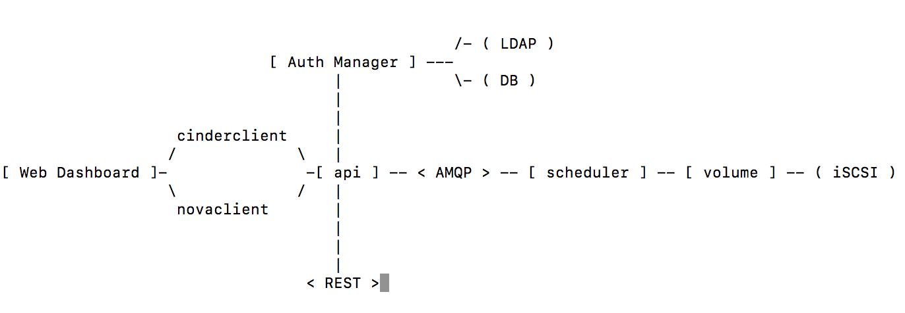
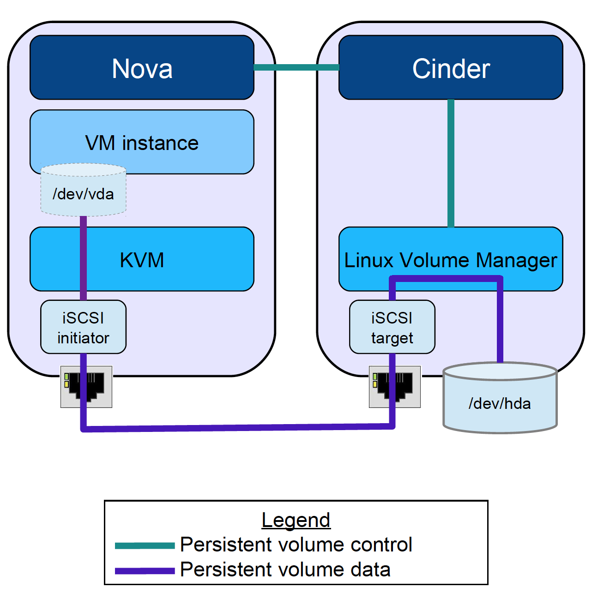

# Cinder
## 历史
  - Cinder的前身是Nova中的nova-volume服务，在Folsom版本发布时，从Nova中剥离作为一个独立的OpenStack项目存在。

## 功能
- 与Nova利用主机本地存储为虚拟机提供的临时存储不同，Cinder为虚拟机提供**持久化的**块存储能力，实现虚拟机**存储卷（Volume）的创建、挂载、卸载、快照等生命周期管理**。
- 什么是块存储？
  - 块是一个字节序列（例如，一个512字节的数据块）。基于块的存储接口是最常见的存储数据方法，它们基于旋转介质，像硬盘、 CD 、软盘、甚至传统的 9 磁道磁带。基于块设备的存储方式，定义为块存储。

## 结构
- overview
  
  - DB: sql database for data storage. Used by all components (LINKS NOT SHOWN).
  - Web Dashboard: potential external component that talks to the api.
  - api: component that receives http requests, converts commands and communicates with other components via the queue or http.
  - Auth Manager: component responsible for users/projects/and roles. Can backend to DB or LDAP. This is not a separate binary, but rather a python class that is used by most components in the system.
  - scheduler: decides which host gets each volume.
  - volume: manages dynamically attachable block devices.

- iSCSI Target
  
  - OSI七层模型中，iSCSI属于传输层协议，规定了iSCSI Target和iSCSI Initiator之间的通信机制。

- 实现方法
  Cinder本身不直接提供块存储设备实际的管理和服务，而是在虚拟机和具体的存储设备之间引入一个抽象的“逻辑存储卷”。Cinder通过添加不同厂商的Driver来整合后端存储设备，并通过提供统一的API接口的方式为云平台提供持久性的块存储服务，类似于Amazon的EBS（Elastic Block Storage）。
- 核心模块
  - cinder-client（作为开端，非核心模块）
    - cinder命令的可执行文件，将用户命令转换位标准的HTTP请求
  - cinder-api
    - 提供RESTful API接口的统一卷管理接口，其主要功能是接受客户端发来的HTTP请求，然后进行用户身份认证和消息分发。Cinder API本质是一个WSGI App，启动Cinder API服务相当于启动一个名为osapi_volume的WSGI服务去监听Client的HTTP请求。实现上主要依赖WSGI服务器、WSGI App、Paste Deploy和路由器技术。
  - cinder-volume
    - 运行在存储节点上管理具体存储设备的存储空间，每个存储节点上都会运行一个cinder-volume服务，多个存储节点构成存储资源池。
    - Volume生命周期管理的真正实现模块。
      - manager.py是cinder-volume最为核心的代码，其中的VolumeManager类用于执行接收到的RPC请求，包含所有有关Volume的生命周期管理的函数都。
  - cinder-scheduler
    - 根据预定的策略选择合适的cinder-volume节点来处理用户的请求。
  - cinder-backup
    - 用于提供卷的备份功能，支持将块存储设备备份到OpenStack备份存储后端，如Swift、Ceph、NFS等。

- 相关主题
  - [参考 【OpenStack 存储剖析】 from IBM developerWorks ](https://www.ibm.com/developerworks/cn/cloud/library/1402_chenhy_openstackstorage/)
  - [参考 【Cinder System Architecture】from docs.openstack.org](https://docs.openstack.org/developer/cinder/devref/architecture.html)
  - 参考 【OpenStack设计与实现（第二版）】
  - 参考 【OpenStack系统架构设计实战】
